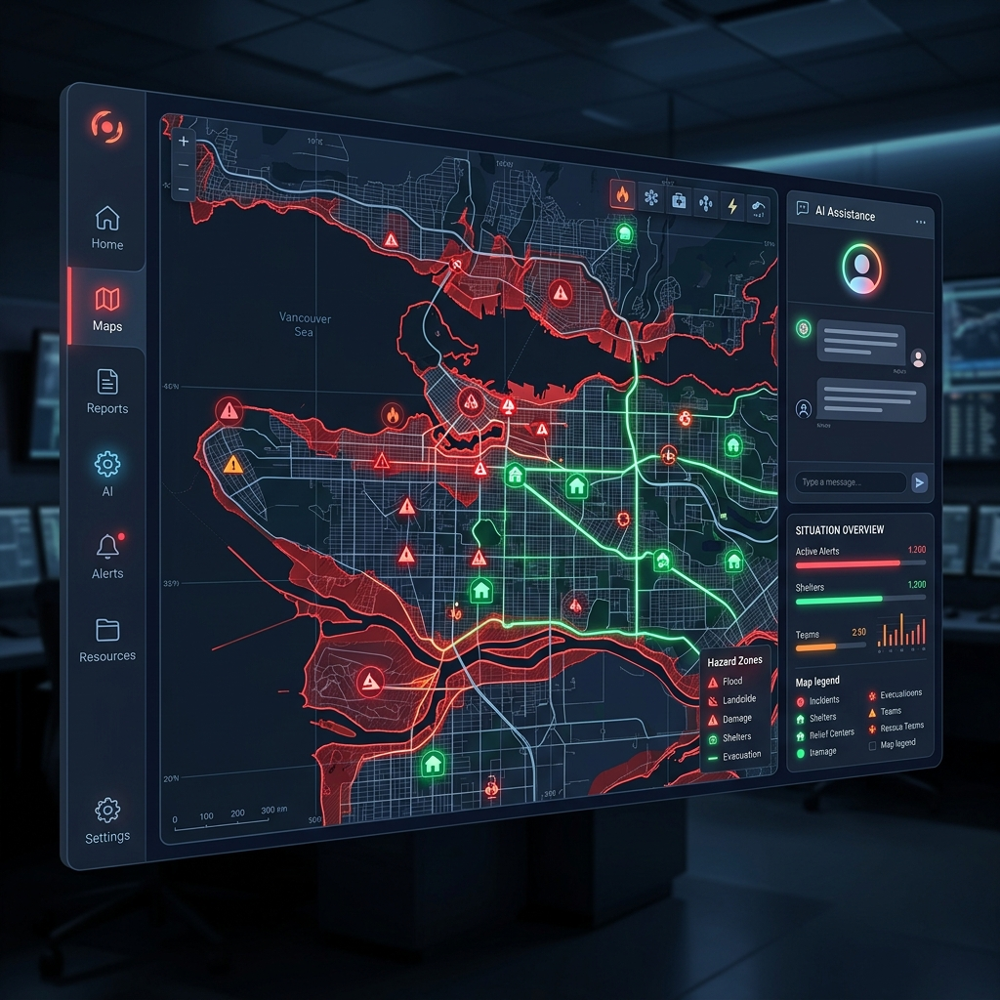
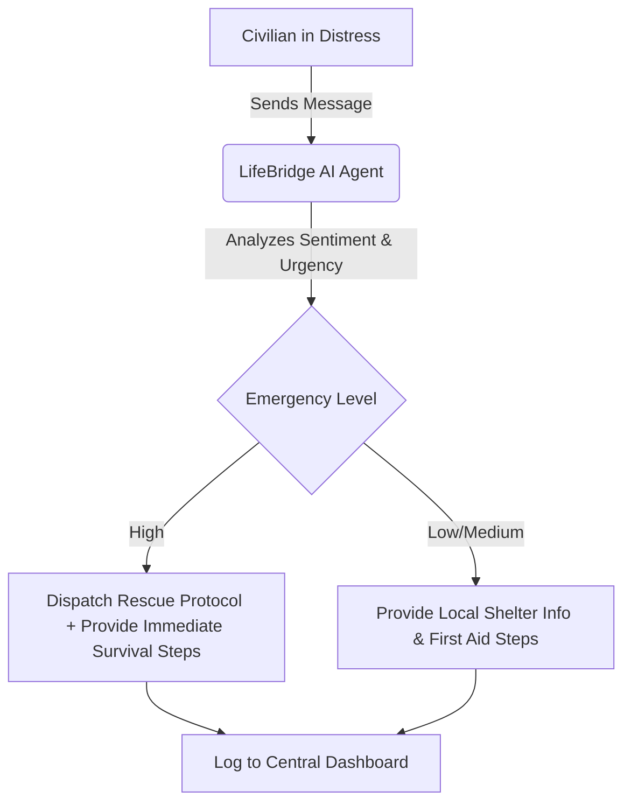
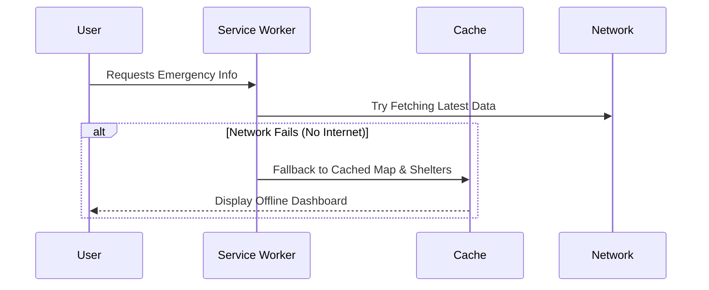
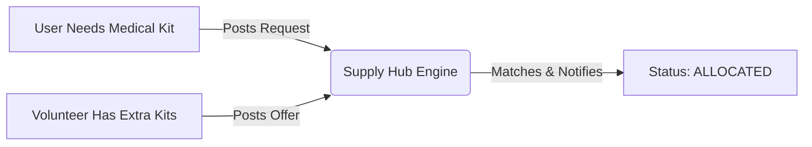

# 🚨 LifeBridge AI

**LifeBridge AI** is an intelligent, offline-capable disaster response and emergency management command center built for the "Agents for Good" hackathon track. It empowers communities and first responders to coordinate effectively during critical crises, such as flash floods or cyclones.



## 🌟 Key Features & Workflows

### 1. 🤖 AI Emergency Responder (Powered by Gemini 1.5 Flash)
An integrated AI agent specialized in disaster response. It provides calm, actionable survival advice, triages emergency requests, and supplies local emergency contact numbers (NDRF, Police, Ambulances) even in high-stress situations.



### 2. 📡 Offline PWA Support
When disaster strikes, cell towers often fail. LifeBridge AI is built as a **Progressive Web App (PWA)**, meaning it can be installed natively on any device and cache critical UI components and emergency shelter locations to work entirely offline.



### 3. 🗺️ Live Disaster Map & Shelters
A real-time GIS map interface tracking active hazards (e.g., severe waterlogging) and safe zones. The **Shelters & Roads** module provides live capacity tracking for relief camps and updates on road closures to prevent stranded civilians.

### 4. 📦 Supply Matching Hub
A decentralized peer-to-peer registry that matches urgent community needs (food, medicine, blankets) with available local resources and offers, allowing neighbors to help neighbors before official aid arrives.



### 5. 👥 Safety Registry & SOS Broadcast
Allows users to check in as "Safe" or "Needs Evacuation", instantly updating a central registry for first responders. Includes a built-in **SOS Trigger** with a fail-safe countdown that broadcasts the user's location with a highly visible on-screen pulsing alert.

---

## 🚀 Getting Started

### Prerequisites
- Node.js 18+
- A Google Gemini API Key

### Installation

1. **Clone the repository:**
   ```bash
   git clone https://github.com/Yaswitha-Chinni/lifebridge-ai.git
   cd lifebridge-ai
   ```

2. **Install dependencies:**
   ```bash
   npm install
   ```

3. **Configure Environment Variables:**
   Create a `.env.local` file in the root directory and add your Gemini API Key:
   ```env
   GEMINI_API_KEY=your_gemini_api_key_here
   ```

4. **Run the Development Server:**
   ```bash
   npm run dev
   ```
   Open [http://localhost:3000](http://localhost:3000) to view the application.

---

## 🛠️ Tech Stack
- **Framework:** Next.js 14 (App Router)
- **AI Integration:** Google Gemini 1.5 Flash API
- **Styling:** Vanilla CSS with Dark Mode Aesthetic
- **Mapping:** Leaflet & React-Leaflet
- **Icons:** Lucide React
- **Offline Capabilities:** `next-pwa`

---
*Built with ❤️ for the Agents for Good Hackathon*
